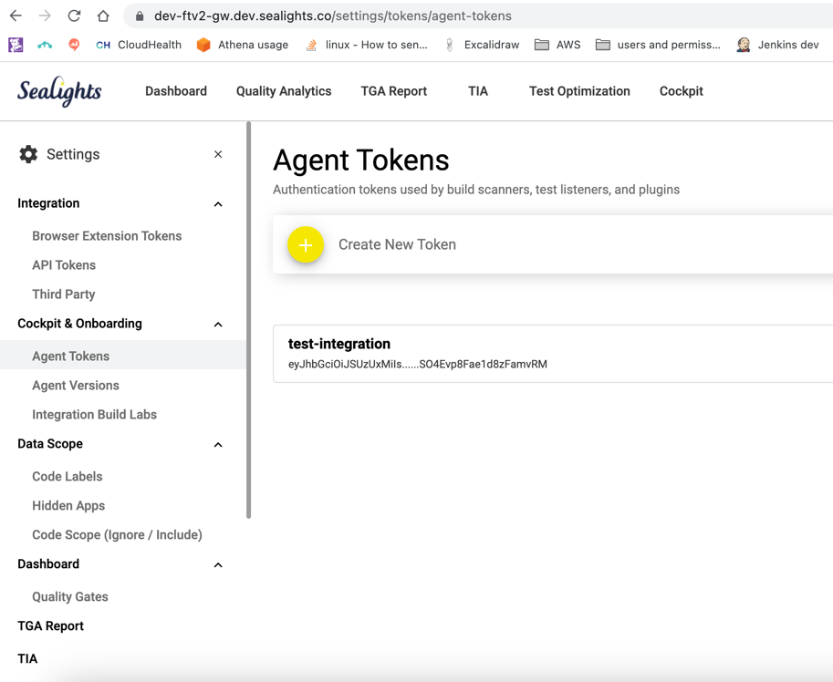
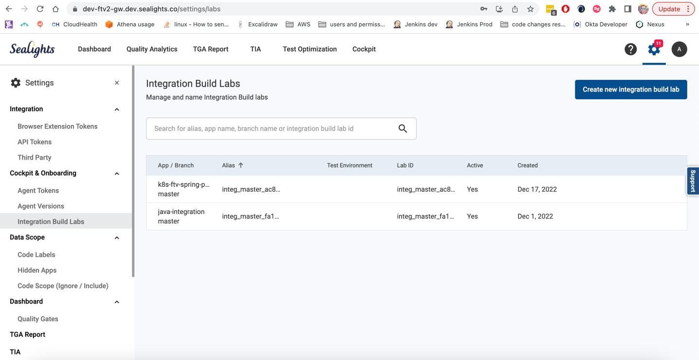

# Setting things up in local Kubernetes

## Prerequisites

* Install lens - https://k8slens.dev/
* Install kubectl - https://kubernetes.io/docs/tasks/tools/
* Install k3d - https://k3d.io/v5.4.6/#installation
* Install helm - https://helm.sh/docs/intro/install/
* Clone this repo - https://github.com/shaicantor/spring-petclinic-cloud.git

## Creating a k8s k3d cluster
```bash
k3d cluster create spring-petclinic-microservices
```

## Build and import the agent image into the cluster (Optional if the agent image is not published to any repository)
```bash
docker build . -t java-agent-ftv:latest

k3d image import java-agent-ftv:latest -c spring-petclinic-microservices
```

## Deploy

```bash
export REPOSITORY_PREFIX=springcommunity
```

### Create the namespace

Create the `spring-petclinic` namespace for Spring petclinic:

```bash
kubectl apply -f k8s/init-namespace/ 
```

Create a Kubernetes secret to store the URL and API Token of Wavefront (replace values with your own real ones):

```bash
kubectl create secret generic wavefront -n spring-petclinic --from-literal=wavefront-url=https://wavefront.surf --from-literal=wavefront-api-token=2e41f7cf-1111-2222-3333-7397a56113ca
```

Create the Wavefront proxy pod, and the various Kubernetes services that will be used later on by our deployments:

```bash
kubectl apply -f k8s/init-services
```

Verify the services are available:

```bash
✗ kubectl get svc -n spring-petclinic
NAME                TYPE           CLUSTER-IP     EXTERNAL-IP   PORT(S)             AGE
api-gateway         LoadBalancer   10.7.250.24    <pending>     80:32675/TCP        36s
customers-service   ClusterIP      10.7.245.64    <none>        8080/TCP            36s
vets-service        ClusterIP      10.7.245.150   <none>        8080/TCP            36s
visits-service      ClusterIP      10.7.251.227   <none>        8080/TCP            35s
wavefront-proxy     ClusterIP      10.7.253.85    <none>        2878/TCP,9411/TCP   37s
```

### Deploy the databases:

```bash
helm repo add bitnami https://charts.bitnami.com/bitnami
helm repo update
helm install vets-db-mysql bitnami/mysql --namespace spring-petclinic --version 8.8.8 --set auth.database=service_instance_db
helm install visits-db-mysql bitnami/mysql --namespace spring-petclinic  --version 8.8.8 --set auth.database=service_instance_db
helm install customers-db-mysql bitnami/mysql --namespace spring-petclinic  --version 8.8.8 --set auth.database=service_instance_db
```

### Set Sealights agent token and lab id
* Open the application deployment files in the k8s directory
* Find the JAVA_TOOL_OPTIONS
* Replace the <token> placeholder with an agent token from the lab you want to report to
  
* Replace the <lab-id> placeholder with an integration build lab from the lab you want to report to
  
  <span style="color:red">make sure the integration build lab has "JIT Scanning" toggled on</span>.
  


### Deploying the application

Our deployment YAMLs have a placeholder called `REPOSITORY_PREFIX` so we'll be able to deploy the images from any Docker registry. Sadly, Kubernetes doesn't support environment variables in the YAML descriptors. We have a small script to do it for us and run our deployments:

```bash
./scripts/deployToKubernetes.sh
```

Verify the pods are deployed:

```bash
✗ kubectl get pods -n spring-petclinic 
NAME                                 READY   STATUS    RESTARTS   AGE
api-gateway-585fff448f-q45jc         1/1     Running   0          4m20s
customers-db-mysql-0                 1/1     Running   0          11m
customers-service-5d7d686654-kpcmx   1/1     Running   0          4m19s
vets-db-mysql-0                      1/1     Running   0          11m
vets-service-85cb8677df-l5xpj        1/1     Running   0          4m2s
visits-db-mysql-0                    1/1     Running   0          11m
visits-service-654fffbcc7-zj2jw      1/1     Running   0          4m2s
wavefront-proxy-dfbd4b695-fdd6t      1/1     Running   0          14m
```

## Teardown
```bash
kubectl delete -f k8s
helm uninstall vets-db-mysql --namespace spring-petclinic
helm uninstall visits-db-mysql --namespace spring-petclinic
helm uninstall customers-db-mysql --namespace spring-petclinic
kubectl delete -f k8s/init-services
helm repo remove bitnami
kubectl delete secret wavefront -n spring-petclinic
kubectl delete namespace spring-petclinic
```
